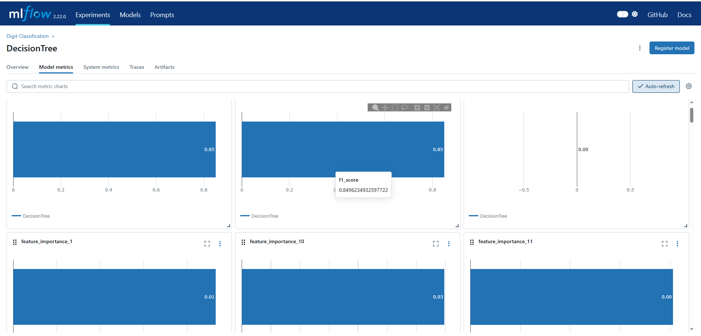
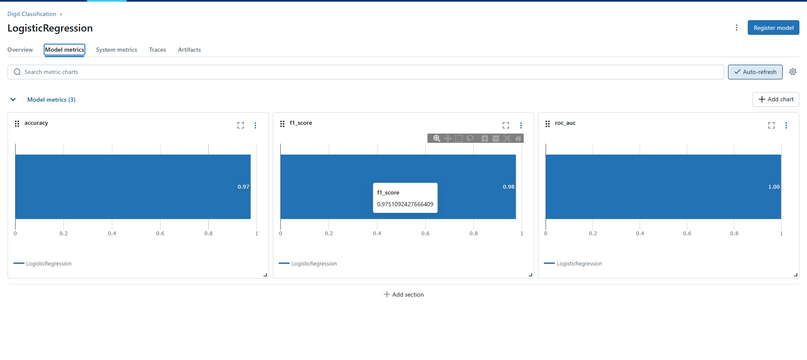
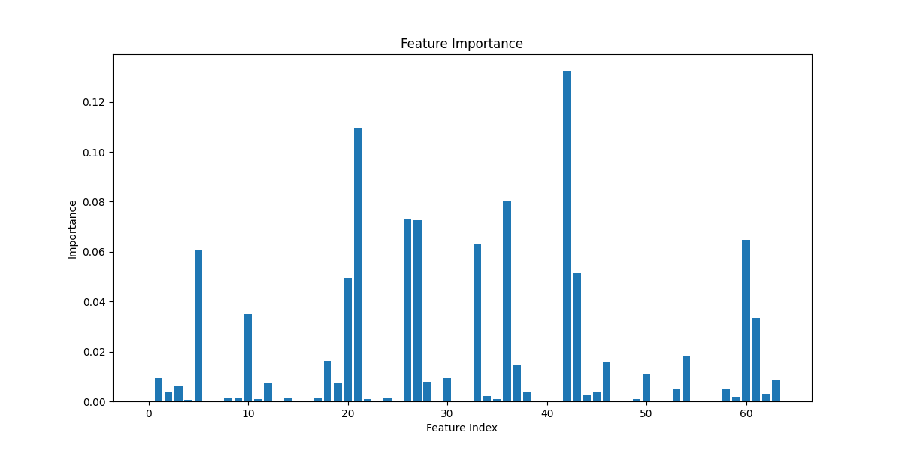
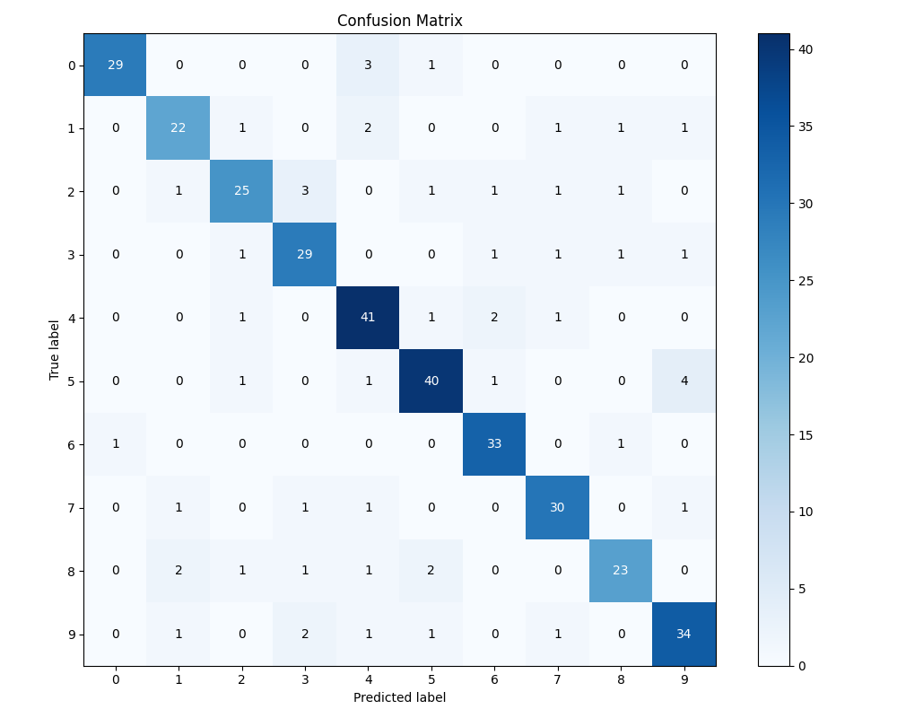

# Трекинг экспериментов ML-моделей

Этот проект демонстрирует использование трех различных систем для трекинга экспериментов машинного обучения: ClearML, Weights & Biases (WandB) и MLFlow. Мы обучаем две модели (Логистическая регрессия и Решающее дерево) на датасете Digits и сравниваем их производительность.

## Установка и настройка

1. Установите необходимые зависимости:
```
pip install -r requirements.txt
```

2. Настройка трекинговых систем
   - **ClearML**: Зарегистрируйтесь на [ClearML](https://app.clear.ml) и выполните `clearml-init` для получения API-ключей
   - **WandB**: Зарегистрируйтесь на [WandB](https://wandb.ai) и выполните `wandb login`
   - **MLFlow**: Запустите локальный сервер MLFlow: `mlflow server --backend-store-uri sqlite:///mlflow.db --default-artifact-root ./artifacts --host 0.0.0.0 --port 5000`

## Структура проекта

- `config.py` - Конфигурационный файл с параметрами моделей
- `data.py` - Функции для загрузки и подготовки данных
- `model1.py` - Логистическая регрессия (LogisticRegression)
- `model2.py` - Решающее дерево (DecisionTree)
- `/clearml` - Реализация с использованием ClearML
- `/wandb` - Реализация с использованием Weights & Biases
- `/mlflow` - Реализация с использованием MLFlow

## Запуск экспериментов

### ClearML
```
cd clearml
python model1.py
python model2.py
```

### Weights & Biases
```
cd wandb
python model1.py
python model2.py
```

### MLFlow
```
cd mlflow
python model1.py
python model2.py
```

## Результаты экспериментов

### ClearML
https://app.clear.ml/projects/3db7ff5d2e194246a36994e891f0d75b/experiments/ddfcdc6a889d4eb6b27bf0144c867e3c/output/execution
https://app.clear.ml/projects/3db7ff5d2e194246a36994e891f0d75b/experiments/0fc8c7c5a18841ecbe60996d2a6bdf18/output/execution

### Weights & Biases
https://api.wandb.ai/links/chdd04-rtu-mirea/rpycw5kf
https://api.wandb.ai/links/chdd04-rtu-mirea/6ti1b0ip

### MLFlow



